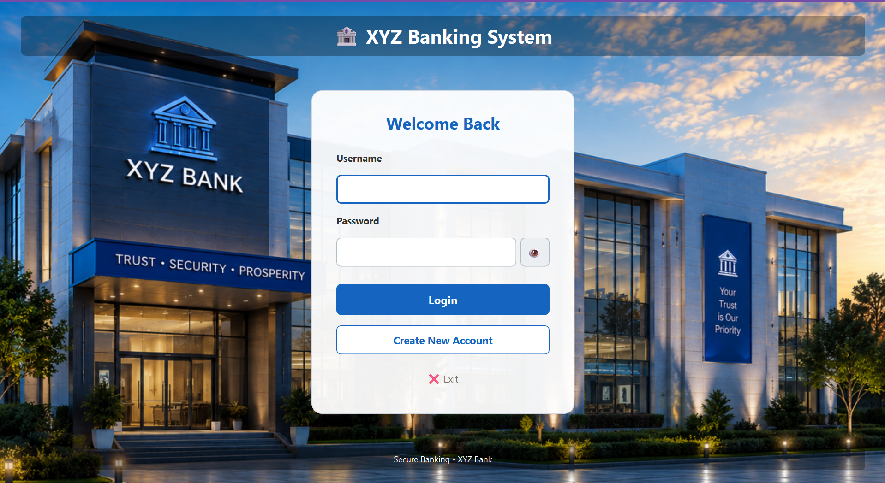
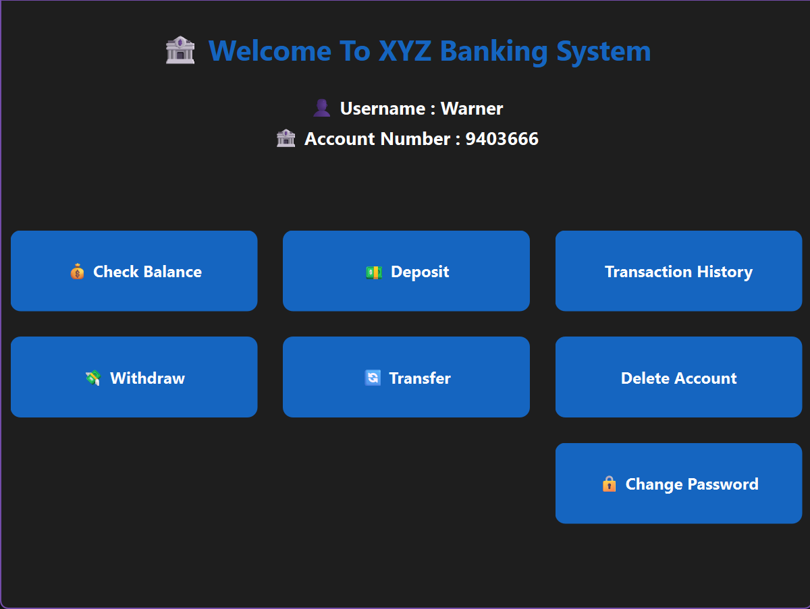
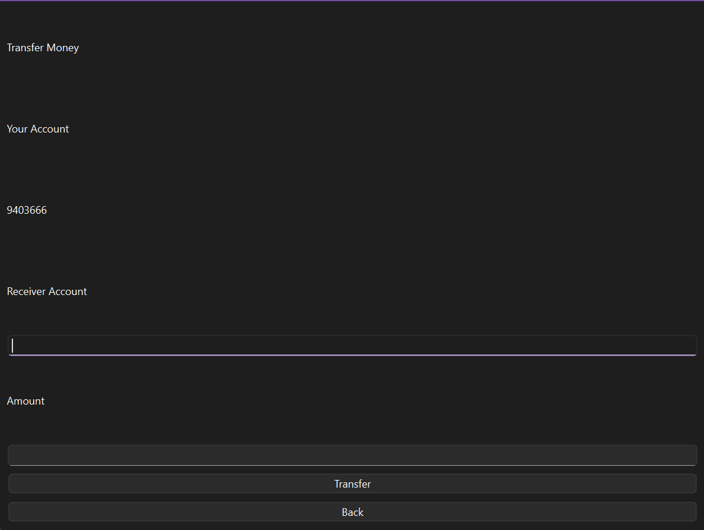
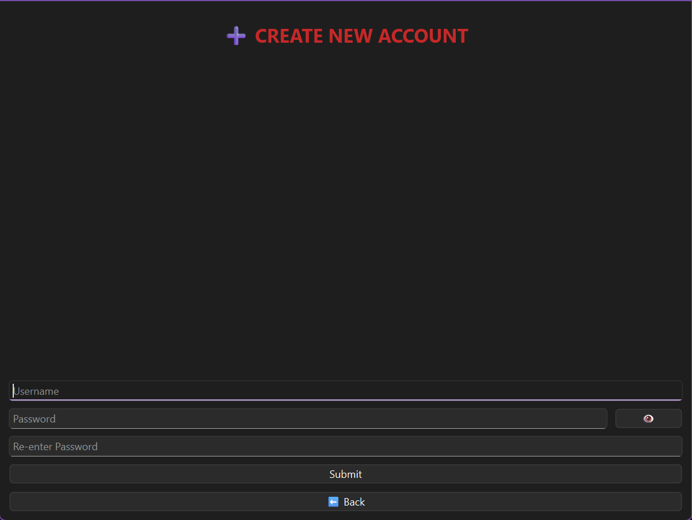
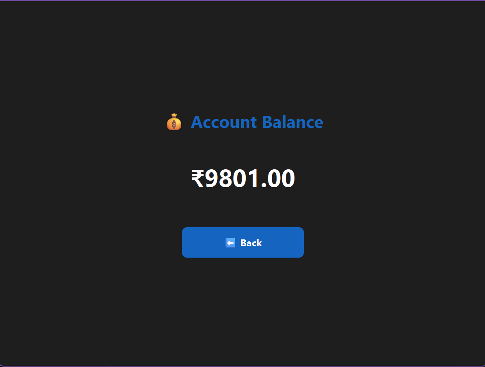
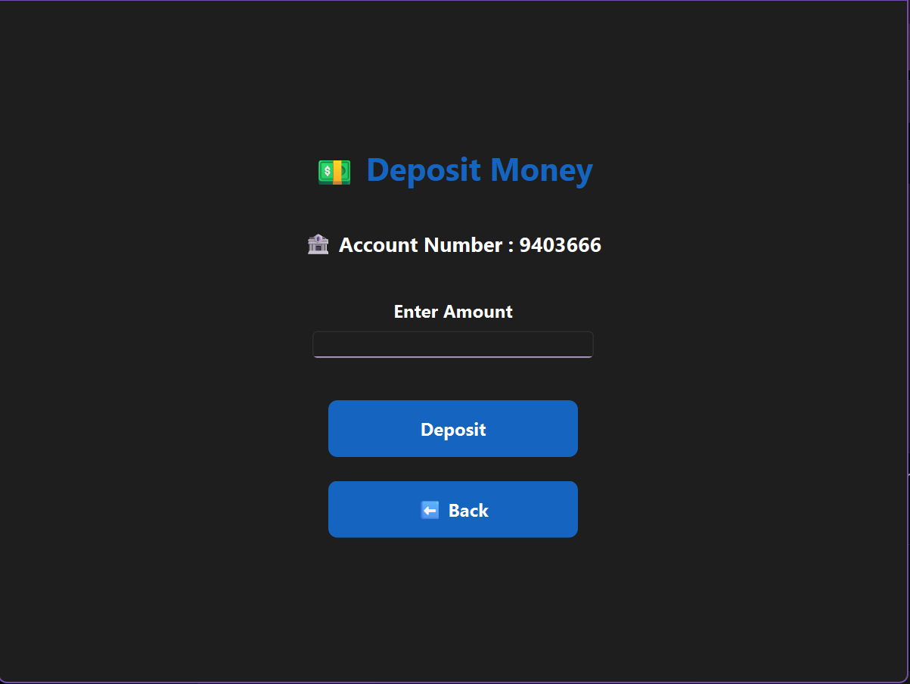
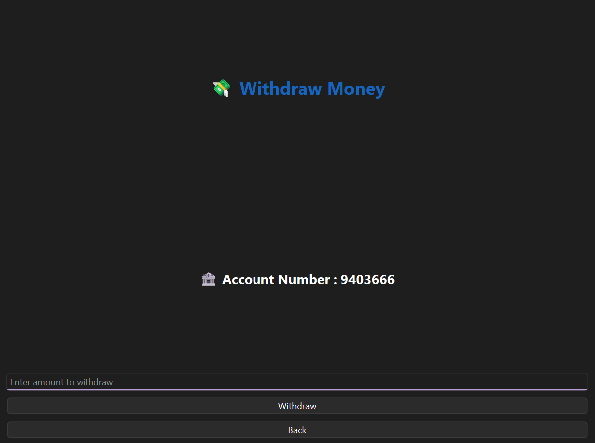
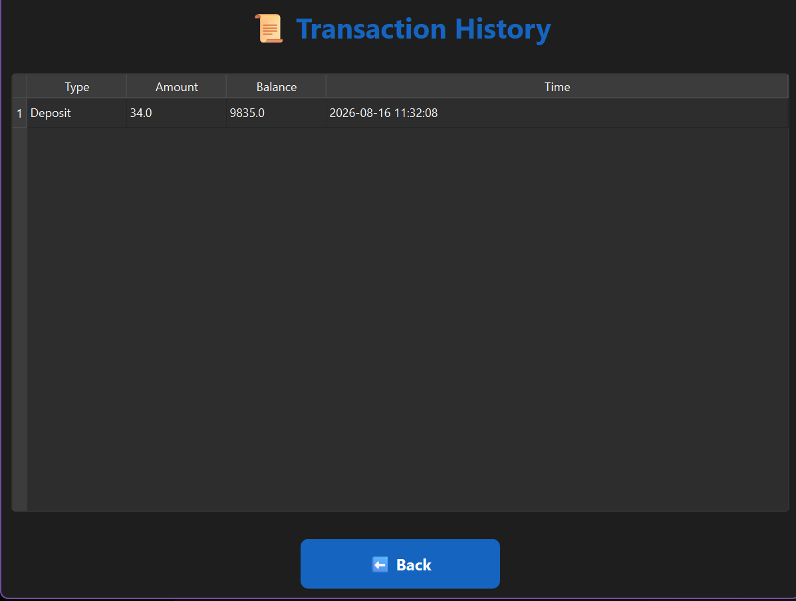
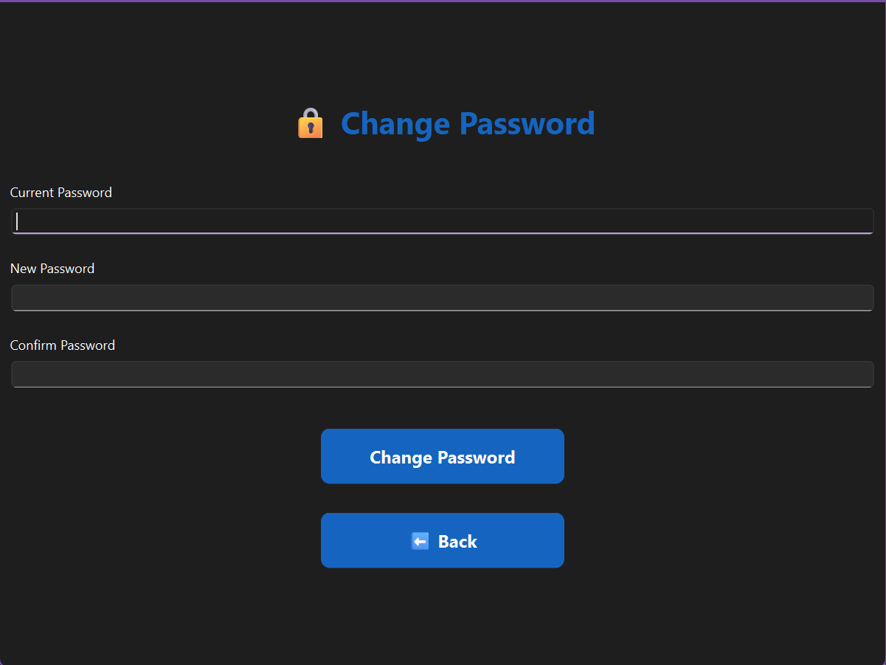

# 🏦 Mini Bank System

A desktop banking application built with **Python, PyQt6, SQLite, bcrypt, and pytest**.

This project is a hands-on learning journey focused on understanding how a real-world application can be designed, implemented, tested, debugged, and improved using layered architecture, separation of responsibilities, secure authentication, database transactions, automated testing, mocking, and GUI development.

> **Project status:** ✅ Core banking, authentication, transaction, account-management, GUI, and automated-testing features implemented.

---

## 📌 Table of Contents

**Part 1 — User Guide**

- [🔎 Overview](#-overview)
- [🚀 Features](#-features)
- [🏗️ Architecture](#️-architecture)
- [⚙️ Installation](#️-installation)
- [▶️ Running the Application](#️-running-the-application)
- [🖥️ GUI Walkthrough](#️-gui-walkthrough)
- [🛣️ Future Roadmap](#️-future-roadmap)
- [⚠️ Disclaimer](#️-disclaimer)
- [👨‍💻 Author](#-author)

**Part 2 — Developer Guide**

- [📂 Project Structure](#-project-structure)
- [🧩 File-by-File Summary](#-file-by-file-summary)
- [🗄️ Database Design](#️-database-design)
- [🔄 Application Flows](#-application-flows)
- [🔐 Security Architecture](#-security-architecture)
- [🧪 Testing Strategy](#-testing-strategy)
- [🎭 Mocking Strategy](#-mocking-strategy)
- [📊 Test Coverage](#-test-coverage)
- [🧪 Running Tests](#-running-tests)
- [💻 Source Code Links](#-source-code-links)
- [🛠️ Development Tools](#️-development-tools)
- [🧠 Concepts Practiced](#-concepts-practiced)
- [🔁 Development Workflow](#-development-workflow)

---

# Part 1 — User Guide

## 🔎 Overview

The **Mini Bank System** is a desktop banking application designed as a practical Python software-engineering project. It simulates the core operations of a real bank — account creation, secure login, deposits, withdrawals, transfers, and transaction history — all wrapped in a clean PyQt6 desktop interface and backed by a SQLite database.

The application supports:

| Category | Capabilities |
|---|---|
| 👤 Accounts | Account creation, account-number generation, account deletion |
| 🔐 Security | bcrypt password hashing, failed-login tracking, account locking |
| 💰 Banking | Balance check, deposit, withdraw, transfer |
| 📜 History | Full transaction history per account |
| 🔑 Credentials | Secure password change with re-verification |
| 🧪 Quality | Automated database, backend, and GUI tests with coverage analysis |

---

## 🚀 Features

### 🔐 User Authentication
- Create new account with username & password
- Username and password validation
- Duplicate-username detection
- Secure password storage using **bcrypt**
- Automatic account-number generation
- Failed login-attempt tracking with account locking
- Login-attempt reset on successful login

### 🛡️ Password Security

Passwords are never stored as plain text:

```text
Plain password:  password123
Stored value:    $2b$12$Pc4Qd5YJ....
```

| Rule | Value |
|---|---|
| Hashing algorithm | bcrypt |
| Minimum length | 8 characters |
| Re-authentication | Required for sensitive changes |

### 💵 Deposit
```text
Deposit Request → Validate Amount → Check Amount > 0 → Update Balance → Record Transaction → Commit
```
Records: account number, transaction type, amount, balance after transaction, timestamp.

### 💸 Withdraw
```text
Withdraw Request → Validate Amount → Check Account → Get Balance → Check Sufficient Funds → Update Balance → Record Transaction → Commit
```
Rejects invalid amounts, zero/negative amounts, unknown accounts, and withdrawals exceeding the balance.

### 🔄 Transfer Money
```text
BEGIN
 ├── Decrease Sender Balance
 ├── Increase Receiver Balance
 ├── Record Transfer Out
 ├── Record Transfer In
 ▼
COMMIT   (or ROLLBACK on failure)
```
Validated against: missing sender/receiver, invalid amount, sender == receiver, insufficient balance.

### 📜 Transaction History
Every transaction (`Deposit`, `Withdraw`, `Transfer Out`, `Transfer In`) is recorded with account number, type, amount, resulting balance, and timestamp — newest first.

### 🔑 Change Password
Requires current-password verification, a new password ≥ 8 characters, and confirmation matching before the new hash is stored. Does **not** affect balance or transaction history.

### 🗑️ Delete Account
Requires password verification before permanently removing account data. Any database failure triggers a rollback to prevent partial deletion.

---

## 🏗️ Architecture

The application follows a simple, layered architecture — each layer has exactly one responsibility.

```text
┌──────────────────────────────┐
│          GUI Layer           │   PyQt6 — user interaction
└──────────────┬───────────────┘
               ▼
┌──────────────────────────────┐
│        Backend Layer         │   Business logic & validation
└──────────────┬───────────────┘
               ▼
┌──────────────────────────────┐
│        Database Layer        │   SQLite — persistent storage
└──────────────────────────────┘
```

| Layer | Responsibility |
|---|---|
| 🖥️ **GUI** | Displays information, collects input, handles clicks, shows dialogs, navigates pages. Never executes SQL directly. |
| ⚙️ **Backend** | Business validation, password hashing/verification, banking rules, calls the database layer, returns success/failure to the GUI. |
| 🗄️ **Database** | Table creation, reads/writes/updates/deletes, transaction handling, history recording. |

This separation means the GUI can change without touching business logic, and the business logic can be tested without a real database (see [Mocking Strategy](#-mocking-strategy)).

---

## ⚙️ Installation

**1. Clone the repository**
```bash
git clone https://github.com/namansinghpatel/Python_Progs/tree/main/Python_Codes/Mini_Bank_System
```
> If the repository is later moved to its own dedicated GitHub repo, update the URL accordingly.

**2. Navigate to the project**
```bash
cd Mini_Bank_System
```

**3. Create a virtual environment**

Windows:
```bash
python -m venv venv
venv\Scripts\activate
```

Linux / macOS:
```bash
python3 -m venv venv
source venv/bin/activate
```

**4. Install dependencies**
```bash
pip install -r requirements.txt
```

---

## ▶️ Running the Application

```bash
python main.py
```

This launches the PyQt6 desktop application, starting at the Login page.

---

## 🖥️ GUI Walkthrough

| Page | Description |
|---|---|
| 🔑 **Login** | Username/password input, show/hide password, login, create account, exit |
| 👤 **Create Account** | Username, password, confirm password, validation messages |
| 🏦 **Welcome** | Main dashboard — balance, deposit, withdraw, transfer, history, change password, delete account |
| 💰 **Balance** | Displays the current balance of the logged-in account |
| 💵 **Deposit** | Enter an amount and deposit money |
| 💸 **Withdraw** | Withdraw after amount and balance validation |
| 🔄 **Transfer** | Transfer money to another account |
| 📜 **Transaction History** | Lists all transactions for the logged-in account |
| 🔐 **Change Password** | Securely change the account password |
| 🗑️ **Delete Account** | Verify password and permanently delete the account |

<p align="center">
  <br>
  <br>
  
</p>

<details>
<summary>📸 View all GUI screenshots</summary>

<p align="center">
  <br><br>
  <br><br>
  <br><br>
  <br><br>
  <br><br>
  <br><br>
  
</p>

</details>

---

## 🛣️ Future Roadmap

**Banking**
- [ ] Profile / Account Dashboard
- [ ] Mini Statement
- [ ] Transaction Search & Filtering
- [ ] Export Bank Statement
- [ ] Interest Calculator
- [ ] Loan Calculator

**Security**
- [ ] Forgot Password
- [ ] OTP Verification
- [ ] Session Management
- [ ] Role-Based Access Control
- [ ] Admin Authentication
- [ ] Audit Logs
- [ ] Stronger Password Policies

**Administration**
- [ ] Admin Dashboard
- [ ] View / Search Accounts
- [ ] Lock / Unlock Accounts
- [ ] Bank-wide Statistics

**Testing**
- [ ] Expand GUI navigation coverage
- [ ] End-to-End tests
- [ ] Integration tests
- [ ] Performance & security tests

---

## ⚠️ Disclaimer

This is a **learning project**. It is not intended to handle real financial accounts, real money, or production banking data. A real banking system would require substantially stronger security, encryption, compliance, auditing, authorization, infrastructure, monitoring, reliability, disaster recovery, and regulatory controls.

---

## 👨‍💻 Author

**Naman Singh Patel**

Built as a learning project to understand Python application development, PyQt6 GUI development, SQLite database design, authentication & security, backend architecture, automated testing, mocking, and general software engineering practice.

---
---

# Part 2 — Developer Guide

This section is for anyone extending, testing, or maintaining the codebase. It covers the file hierarchy, what each file is responsible for, the database schema, internal flows, and the tools used during development.

## 📂 Project Structure

```text
Mini_Bank_System/
│
├── main.py                          # Application entry point
│
├── GUI/                              # PyQt6 presentation layer
│   ├── __init__.py
│   ├── login_page.py
│   ├── create_account_page.py
│   ├── welcome_page.py
│   ├── balance_page.py
│   ├── deposit_page.py
│   ├── withdraw_page.py
│   ├── transfer_page.py
│   ├── history_page.py
│   ├── change_password_page.py
│   └── delete_account_page.py
│
├── Backend/                          # Business logic layer
│   ├── __init__.py
│   ├── account_service.py
│   ├── auth_service.py
│   ├── validators.py
│   └── security.py
│
├── Database/                         # Persistence layer
│   ├── __init__.py
│   ├── sqlitedb.py
│   └── xyz_bank.db
│
├── Tests/                            # Automated test suite
│   ├── __init__.py
│   ├── conftest.py
│   ├── sqlitedb_test.py
│   │
│   ├── test_Backend/
│   │   └── test_account_service.py
│   │
│   └── test_GUI/
│       ├── test_login.py
│       ├── test_create_account.py
│       ├── test_transfer_page.py
│       ├── test_transaction_history.py
│       ├── change_password_page_test.py
│       └── ...
│
├── Docs/
│   └── Images/
│       └── GUI/                      # Screenshots used in this README
│           ├── login_page.png
│           ├── create_account_page.png
│           ├── welcome_page.png
│           ├── balance_page.png
│           ├── deposit_page.png
│           ├── withdraw_page.png
│           ├── transfer_page.png
│           ├── history_page.png
│           ├── change_password_page.png
│           └── delete_account_page.png
│
├── requirements.txt
├── .gitignore
└── README.md
```

---

## 🧩 File-by-File Summary

### ⚙️ Backend
| File | Responsibility |
|---|---|
| `account_service.py` | Core banking logic — account-number generation, balance retrieval, deposit, withdraw, transfer, transaction history, account deletion, password change |
| `auth_service.py` | User registration, login, authentication, failed-login tracking, account locking, login-attempt reset |
| `validators.py` | Reusable input-validation rules shared across the app |
| `security.py` | bcrypt password hashing and verification |

Example backend function surface:
```python
generate_account_number()
get_account_balance()
deposit_money()
withdraw_money()
transfer_money()
get_transaction_history()
delete_account()
change_password()
```

### 🗄️ Database
| File | Responsibility |
|---|---|
| `sqlitedb.py` | All SQLite operations — user creation/lookup, balance operations, deposits, withdrawals, transfers, transaction recording/retrieval, password updates, account deletion, login-attempt handling |

Example database function surface:
```python
get_balance()
deposit_money()
withdraw_money()
transfer_money()
add_transaction()
get_transactions()
update_password()
delete_account()
```

### 🖥️ GUI
| File | Responsibility |
|---|---|
| `login_page.py` | Login form, credential submission, navigation to Create Account |
| `create_account_page.py` | New-account form and validation feedback |
| `welcome_page.py` | Main dashboard hub linking to all banking operations |
| `balance_page.py` | Displays current balance |
| `deposit_page.py` | Deposit form |
| `withdraw_page.py` | Withdraw form |
| `transfer_page.py` | Transfer form |
| `history_page.py` | Transaction history list |
| `change_password_page.py` | Password-change form |
| `delete_account_page.py` | Account-deletion confirmation flow |

The GUI uses a `QStackedWidget` to navigate between these pages and never talks to the database directly — it only calls Backend functions.

### 🧪 Tests
| File / Folder | Responsibility |
|---|---|
| `conftest.py` | Shared pytest fixtures (e.g. `test_db`) |
| `sqlitedb_test.py` | Database-layer tests against a real SQLite test database |
| `test_Backend/test_account_service.py` | Backend logic tests with the database mocked |
| `test_GUI/*` | GUI behavior tests using `pytest-qt`, with the Backend mocked |

---

## 🗄️ Database Design

SQLite database file: `Database/xyz_bank.db`

**`users` table**
```text
users
├── id
├── account_number
├── username
├── password           (bcrypt hash)
├── balance
├── failed_attempts
└── locked_until
```

**`transactions` table**
```text
transactions
├── id
├── account_number
├── transaction_type    (Deposit / Withdraw / Transfer Out / Transfer In)
├── amount
├── balance_after
└── transaction_time
```

The two tables are linked via `account_number`.

### 🔄 Transactional Integrity

The transfer operation uses explicit transaction handling so multiple writes succeed or fail as one unit:

```text
BEGIN
  ↓
Update Sender
  ↓
Update Receiver
  ↓
Add Sender Transaction
  ↓
Add Receiver Transaction
  ↓
COMMIT   (ROLLBACK on any failure)
```

---

## 🔄 Application Flows

<details>
<summary><strong>👤 Create Account</strong></summary>

```text
Create Account → Validate Username → Validate Password → Check Duplicate Username
→ Generate Account Number → Hash Password → Store User → Success
```
</details>

<details>
<summary><strong>🔑 Login</strong></summary>

```text
Login → Validate Input → Check Account Lock → Fetch Stored Password Hash
→ Verify Password → Reset Login Attempts → Welcome Page
```
</details>

<details>
<summary><strong>💵 Deposit</strong></summary>

```text
Deposit Request → Validate Amount → Update Balance → Get New Balance
→ Record Transaction → Commit
```
</details>

<details>
<summary><strong>💸 Withdraw</strong></summary>

```text
Withdraw Request → Validate Amount → Get Current Balance → Check Sufficient Balance
→ Update Balance → Record Transaction → Commit
```
</details>

<details>
<summary><strong>🔄 Transfer</strong></summary>

```text
Transfer Request → Validate Accounts → Validate Amount → Check Balance
→ BEGIN TRANSACTION → Decrease Sender Balance → Increase Receiver Balance
→ Record Both Transactions → COMMIT   (ROLLBACK on failure)
```
</details>

<details>
<summary><strong>🔐 Change Password</strong></summary>

```text
Change Password → Validate Input → Verify Current Password → Validate New Password
→ Hash New Password → Update Database → Success → Return To Login
```
</details>

<details>
<summary><strong>🗑️ Delete Account</strong></summary>

```text
Delete Account → Confirm Action → Verify Password → Delete Account Data
→ Commit → Return To Login
```
</details>

---

## 🔐 Security Architecture

**Password storage (registration / change password)**
```text
User Password → hash_password() → bcrypt Hash → SQLite
```

**Password verification (login)**
```text
Entered Password → verify_password() → Stored bcrypt Hash → True / False
```

The application never decrypts bcrypt hashes — verification is one-way comparison only.

---

## 🧪 Testing Strategy

The project uses `pytest`, `pytest-qt`, `unittest.mock`, and `pytest-cov`, with tests split by layer:

```text
                    Tests
                      │
          ┌───────────┼───────────┐
          ▼           ▼           ▼
      Database     Backend       GUI
       Tests        Tests       Tests
```

**Backend tests** isolate business logic by mocking the database:
```python
@patch("Backend.account_service.sqlitedb")
def test_transfer_money_database_failure(mock_db):
    mock_db.get_balance.side_effect = [1000, 500]
    mock_db.transfer_money.return_value = False
    success, message = transfer_money("1001", "1002", "300")
    assert success is False
    assert message == "Transfer failed."
```
`Test → Backend → Mock Database` — the real SQLite database is not required.

**Database tests** use the `test_db` fixture and run real SQLite operations:
```python
def test_reset_login_attempts(test_db):
    test_db.create_user("1234567", "prashant", "password123")
    test_db.update_failed_attempts("prashant", 3)
    test_db.lock_user("prashant", "2099-01-01T00:00:00")
    test_db.reset_login_attempts("prashant")
    assert test_db.get_failed_attempts("prashant") == 0
    assert test_db.get_locked_until("prashant") is None
```

**GUI tests** use `pytest-qt` and mock the Backend:
```python
@patch("GUI.transfer_page.transfer_money")
def test_transfer_button_click(mock_transfer, qtbot):
    page = TransferPage(None)
    qtbot.addWidget(page)
    page.account_number = "1001"
    page.receiver_input.setText("1002")
    page.amount_input.setText("300")
    mock_transfer.return_value = (True, "Success")
    page.transfer_btn.click()
    mock_transfer.assert_called_once()
```

---

## 🎭 Mocking Strategy

Each layer is tested in isolation:

| Layer under test | Calls through to | Real dependency used? |
|---|---|---|
| Backend | Mock Database | ❌ No |
| GUI | Mock Backend | ❌ No |
| Database | Real Test Database (SQLite) | ✅ Yes |

Benefits: faster tests, isolated failures, predictable behavior, easier debugging, and no unnecessary coupling between layers.

---

## 📊 Test Coverage

Coverage is measured with `pytest-cov`:

```bash
pytest --cov=Backend --cov=Database --cov-report=term-missing
```

Coverage is used during development to find untested branches, not just to chase a percentage. It has been used to investigate:

- Password validation branches
- Account-not-found branches
- Database failure branches
- Transfer failure branches
- Delete-account failure branches
- GUI error paths

---

## 🧪 Running Tests

```bash
# Run everything
pytest

# Verbose output
pytest -v

# Backend tests only
pytest Tests/test_Backend/

# GUI tests only
pytest Tests/test_GUI/

# Database tests only
pytest Tests/sqlitedb_test.py

# With coverage report
pytest --cov=Backend --cov=Database --cov-report=term-missing
```

---

## 💻 Source Code Links

GUI screenshots demonstrate the visual interface above; for implementation details, the Python source is available directly on GitHub.

| Module | Description | Link |
|---|---|---|
| `account_service.py` | Account-number generation, balance, deposit, withdraw, transfer, history, deletion, password change | [View on GitHub](https://github.com/namansinghpatel/Mini_Bank_System/blob/main/Backend/account_service.py) |
| `auth_service.py` | Registration, login, authentication, failed attempts, locking | [View on GitHub](https://github.com/namansinghpatel/Mini_Bank_System/blob/main/Backend/auth_service.py) |
| `validators.py` | Reusable input-validation rules | [View on GitHub](https://github.com/namansinghpatel/Mini_Bank_System/blob/main/Backend/validators.py) |
| `security.py` | bcrypt hashing & verification | [View on GitHub](https://github.com/namansinghpatel/Mini_Bank_System/blob/main/Backend/security.py) |
| `sqlitedb.py` | All SQLite operations | [View on GitHub](https://github.com/namansinghpatel/Mini_Bank_System/blob/main/Database/sqlitedb.py) |

**Why links instead of code screenshots?** The full file can be viewed and searched directly on GitHub, it always reflects the latest version, code changes never require new README screenshots, and the README stays clean and easy to navigate.

---

## 🛠️ Development Tools

| Tool | Purpose |
|---|---|
| **Python 3** | Core language |
| **PyQt6** | Desktop GUI framework |
| **SQLite** | Embedded relational database |
| **bcrypt** | Password hashing |
| **pytest** | Test runner |
| **pytest-qt** | GUI testing utilities for PyQt |
| **unittest.mock** (`@patch`, `MagicMock`) | Test isolation via mocking |
| **pytest-cov** | Coverage analysis and reporting |
| **venv** | Virtual environment / dependency isolation |

---

## 🧠 Concepts Practiced

**Python** — classes, objects, methods, `self`, functions, imports, modules, packages, tuples, exception handling, return values

**GUI Development** — PyQt6, `QWidget`, `QLabel`, `QPushButton`, `QLineEdit`, layouts, signals & slots, `QStackedWidget`, `QMessageBox`, GUI state management

**Backend** — service-layer architecture, business validation, separation of concerns, error handling, GUI/backend separation, consistent success/failure returns

**Database** — SQLite, parameterized queries, `SELECT` / `INSERT` / `UPDATE` / `DELETE`, `COMMIT` / `ROLLBACK`, transaction history

**Security** — bcrypt, password hashing & verification, secure storage, re-authentication, account locking

**Testing** — pytest, pytest-qt, fixtures, assertions, `@patch`, `MagicMock`, GUI/Backend/Database testing, test isolation, coverage analysis

---

## 🔁 Development Workflow

Each feature is developed incrementally:

```text
Requirement → Understand the Flow → Database Implementation → Backend Implementation
→ GUI Implementation → Database Tests → Backend Tests → GUI Tests
→ Run Test Suite → Coverage Analysis → Fix Failures → Repeat
```

This project focuses not only on writing code, but on understanding the reason behind each layer, debugging test failures, improving test coverage, separating responsibilities, handling database failures, using mocks correctly, and testing GUI behavior independently.

**Long-term goal:**
```text
Learn → Build → Test → Debug → Improve → Repeat
```

---

> **Note:** Keep GUI screenshots in `Docs/Images/GUI/`. Backend, Database, Validator, and Security source code is available through the clickable GitHub links in [Source Code Links](#-source-code-links).
